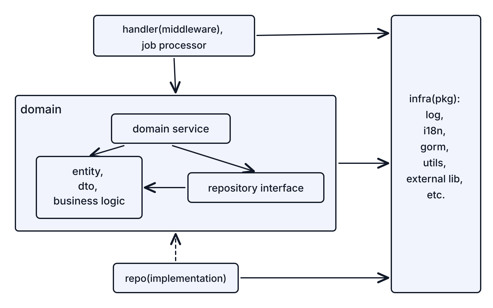

# MatrixHub Code Architecture

This document defines the backend architecture rules for MatrixHub. It is the
human-readable source of truth for Go package boundaries, dependency direction,
and where business logic should live.

For UI work, follow [`ui/AGENTS.md`](../ui/AGENTS.md).

## Architecture Model

MatrixHub follows a lightweight DDD and ports-and-adapters structure. A solid or
dashed arrow from A to B means "A depends on or imports B".

`internal/domain` must not import or directly call `internal/repo`; dependencies
only flow from `internal/repo` to `internal/domain`.

## Boundary Rules

These are hard rules:

- `internal/domain` owns entities, DTOs, business logic, services, and repository
  interfaces. It may depend only on public/common `internal/infra` packages, not
  handlers, job processors, or repository implementations.
- Handlers and job processors call domain services or repository interfaces.
  They must not import `internal/repo` implementations.
- Domain services depend only on repository interfaces defined in
  `internal/domain`, never on their implementations.
- `internal/repo` implements domain repository interfaces and handles databases,
  external APIs, queues, and object storage.
- `internal/infra` provides reusable technical utilities such as logging, i18n,
  database setup, and common helpers. It must not contain business logic.

## Code Placement

| Path | Responsibility |
| --- | --- |
| `internal/apiserver/handler/...` | HTTP/gRPC transport, middleware, auth extraction, request/response mapping, and error translation |
| `internal/jobserver/...` | Background entrypoints, scheduling, polling, work claiming, processors, and workers |
| `internal/domain/...` | Entities, value objects, DTOs, business rules, services/use cases, and owned interfaces |
| `internal/repo/...` | Implementations of domain interfaces and integrations with external systems |
| `internal/infra/...` | Shared logging, i18n, errors, database wiring, GORM models, clients, and utilities |
