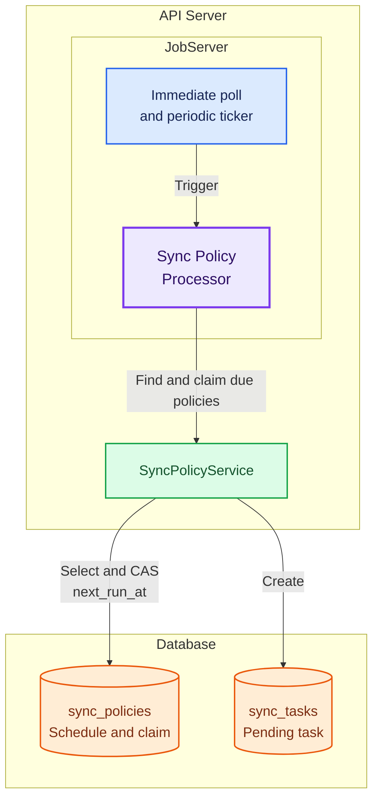
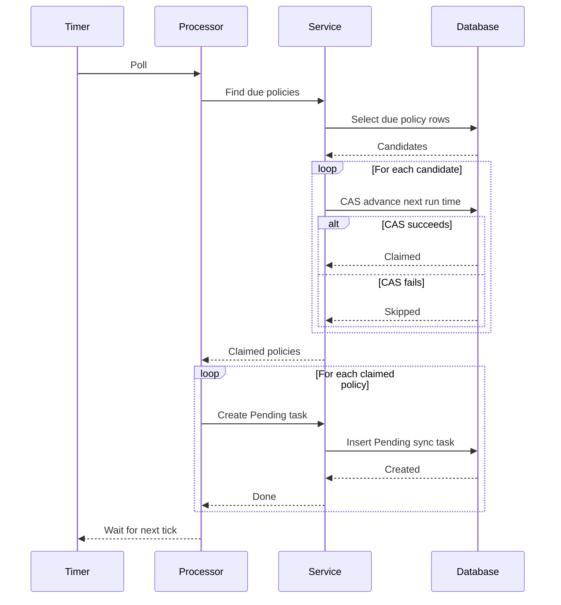
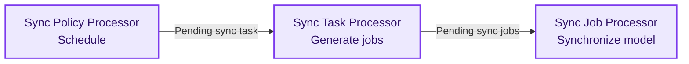

# JobServer Technical Design

## Goals

JobServer runs cron-scheduled or manually triggered background jobs without
blocking API requests. Model synchronization is the first use case; cleanup and
other jobs can reuse the same framework.

- Add each job type as an independent processor with its own concurrency and
  timeout limits.
- Persist and claim jobs in the database with compare-and-swap (CAS); no
  external queue is needed.
- Run with the API server to keep phase-one deployment simple.

## Delayed-job architecture

All processors use the same delayed-job pattern. The following diagram uses
`syncPolicy processor` as the example.

1. JobServer triggers the Sync Policy Processor at startup and on each tick.
2. The processor asks `SyncPolicyService` for policies that are due to run.
3. The service claims each policy by atomically advancing its `next_run_at`.
4. For every claimed policy, the service creates a Pending sync task for the
   next processor.

### Detailed sequence

The other processors reuse the same structure:

| Processor | Poll and claim | Execute |
|---|---|---|
| `syncPolicy` | Due `next_run_at`; CAS advances the schedule | Create a Pending task |
| `syncTask` | Pending task; CAS to Running | Generate Pending jobs |
| `syncJob` | Pending job; CAS to Running | Run Git synchronization |

Manual synchronization skips `syncPolicy` and creates a Pending task directly.

### Processing pipeline

**Three-stage pipeline:** policy scheduling, job generation, and transfer
execution can be tuned independently.

## Configuration

JobServer settings and defaults are defined under
[`jobServer` in `values.yaml`](../../deploy/charts/matrixhub/values.yaml).

## Phase-one boundaries

- Run one JobServer-enabled API replica.
- CAS prevents duplicate claim winners but does not provide execution leases.
- Detected failures are recorded but not retried; abandoned work is not
  recovered.
- Cancellation and job logs are local to the API server process.
- Multi-replica recovery, shared logs, retry policies, and worker metrics are
  future improvements.
